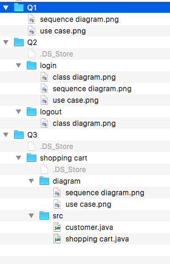

# Give-Me-Folder
A small shell script which is used to organize files in folders with their filename patterns

I am a lazy person and I like to save many files especially screen captures into one messy single folder. 
However, I hate to organize the files by draging them into different folders and rename them one by one.
As inspired by the Amazon online storage, the shell script is to organize files into folders with levels.
By default, it uses the "," to separate levels.

For example, a folder contains following files: 
* note.docx
* projectA,requirement.docx
* projectA,plan.docx
* projectA,graph,usecase.png
* projectA,graph,sequence.png

After the shell script is executed, the folder will looks like

```
Current Directory
│   note.docx
│
└───projectA
    │   requirement.docx
    |   plan.docx
    │
    ├───graph
    │   │   usecase.png
    │   │   sequence.png
    │   │   ...
```

# More example
Suppose I got following files:
- Q1,use case.png
- Q1,sequence diagram.png
- Q2,login,class diagram.png
- Q2,login,use case.png
- Q2,login,sequence diagram.png
- Q2,logout,class diagram.png
- Q3,shopping cart,diagram,use case.png
- Q3,shopping cart,diagram,sequence diagram.png
- Q3,shopping cart,src,customer.java
- Q3,shopping cart,src,shopping cart.java

After the script is executed, the file strcutrue looks like:




# How to install
1. Download the `gmf.sh`
2. Add the line into your shell folder `alias gmf='sh <path-to-the-shellscript>/gmf.sh'`
3. Run the shell script in the root directory in which you want to organize the file
